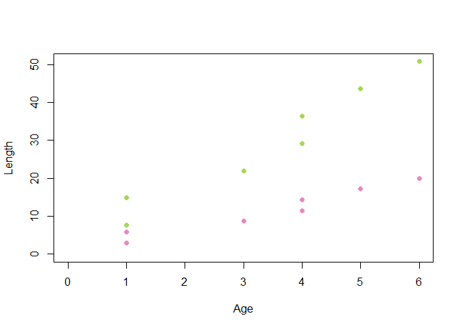
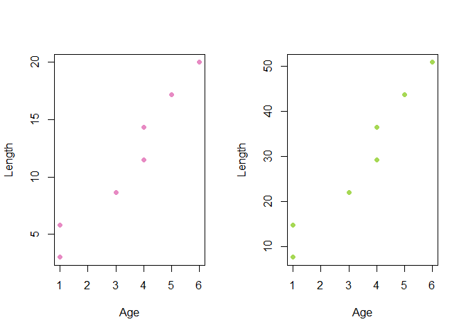

For Loops in R
================
Meg Oshima
July 27, 2018

-   [What is a for loop?](#what-is-a-for-loop)
-   [When and how do you use it?](#when-and-how-do-you-use-it)
-   [Practice writing your own loops](#practice-writing-your-own-loops)
-   [Control Statements](#control-statements)
    -   [Possible solutions](#possible-solutions)
-   [Using for loops to plot](#using-for-loops-to-plot)
-   [Nested loops](#nested-loops)
-   [Alternatives to for loops](#alternatives-to-for-loops)

What is a for loop?
-------------------

A for loop is a process that lets you automate a portion of your code by repeating a sequence of instructions a specified number of times. There are a couple of different types of loops (while, for, repeat) and they all have the same structure and purpose. For loops are executed a specified number of times by a vector.

When and how do you use it?
---------------------------

For loops are used when you find yourself repeating the same lines of code. If you want to do the same thing to an entire vector, matrix, or even list. The structure of a for loop is fairly simple, it contains a looping index, an object to loop through, and the actions you want to perform.

``` r
for (variable in vector) {
  expression
}
```

There are 2 ways to write the looping variable, they each have advantages. The first way is to say `for (name in vector)`. The second way is to use a number index such as `for (i in 1:length(vector))`. The first way is easy to read and simple but it doesn't give you an index value. The second one is more writing and not as easy to read sometimes but it gives us more control and options in the expression portion. The second way is more commonly used, especially when you need to subset or index from another vector.

``` r
set.seed(10)
df <- data.frame(Name = c("A", "B", "C", "D", "E", "F", "G"), 
                 Age = seq(0,6,1),
                 Month = sample(seq(1,12), 7, replace = T),
                 Length.in = round(seq(3,20,length.out = 7),2))
df
```

    ##   Name Age Month Length.in
    ## 1    A   0     7      3.00
    ## 2    B   1     4      5.83
    ## 3    C   2     6      8.67
    ## 4    D   3     9     11.50
    ## 5    E   4     2     14.33
    ## 6    F   5     3     17.17
    ## 7    G   6     4     20.00

``` r
for(a in df$Length.in){
    print(a)
}
```

    ## [1] 3
    ## [1] 5.83
    ## [1] 8.67
    ## [1] 11.5
    ## [1] 14.33
    ## [1] 17.17
    ## [1] 20

``` r
for(a in df){
  print(a)
}
```

    ## [1] A B C D E F G
    ## Levels: A B C D E F G
    ## [1] 0 1 2 3 4 5 6
    ## [1] 7 4 6 9 2 3 4
    ## [1]  3.00  5.83  8.67 11.50 14.33 17.17 20.00

``` r
#Calculating length in inches using name method of writing loop
lengths.cm <- c()
for(i in df$Length.in){
  lengths.cm[i] <- i*2.54
  print(lengths.cm)
}
```

    ## [1]   NA   NA 7.62
    ## [1]      NA      NA  7.6200      NA 14.8082
    ## [1]      NA      NA  7.6200      NA 14.8082      NA      NA 22.0218
    ##  [1]      NA      NA  7.6200      NA 14.8082      NA      NA 22.0218
    ##  [9]      NA      NA 29.2100
    ##  [1]      NA      NA  7.6200      NA 14.8082      NA      NA 22.0218
    ##  [9]      NA      NA 29.2100      NA      NA 36.3982
    ##  [1]      NA      NA  7.6200      NA 14.8082      NA      NA 22.0218
    ##  [9]      NA      NA 29.2100      NA      NA 36.3982      NA      NA
    ## [17] 43.6118
    ##  [1]      NA      NA  7.6200      NA 14.8082      NA      NA 22.0218
    ##  [9]      NA      NA 29.2100      NA      NA 36.3982      NA      NA
    ## [17] 43.6118      NA      NA 50.8000

``` r
#Calculating length in inches using indexing method of writing loop
lengths.cm <- c()
for(i in 1:nrow(df)){
  lengths.cm[i] <- df$Length.in[i]*2.54
  df$Length.cm[i] <- lengths.cm[i]
  print(lengths.cm)
}
```

    ## [1] 7.62
    ## [1]  7.6200 14.8082
    ## [1]  7.6200 14.8082 22.0218
    ## [1]  7.6200 14.8082 22.0218 29.2100
    ## [1]  7.6200 14.8082 22.0218 29.2100 36.3982
    ## [1]  7.6200 14.8082 22.0218 29.2100 36.3982 43.6118
    ## [1]  7.6200 14.8082 22.0218 29.2100 36.3982 43.6118 50.8000

``` r
df
```

    ##   Name Age Month Length.in Length.cm
    ## 1    A   0     7      3.00    7.6200
    ## 2    B   1     4      5.83   14.8082
    ## 3    C   2     6      8.67   22.0218
    ## 4    D   3     9     11.50   29.2100
    ## 5    E   4     2     14.33   36.3982
    ## 6    F   5     3     17.17   43.6118
    ## 7    G   6     4     20.00   50.8000

``` r
#To find the difference in lengths between each fish
for(i in 1:nrow(df)-1){
  print(df$Length.in[i+1] - df$Length.in[i])
}
```

    ## numeric(0)
    ## [1] 2.83
    ## [1] 2.84
    ## [1] 2.83
    ## [1] 2.83
    ## [1] 2.84
    ## [1] 2.83

Practice writing your own loops
-------------------------------

``` r
#Write a loop to calculate 1/2, 2/3, 3/4, and 5/6.

for(i in 1: ){
  
  
}
```

Control Statements
------------------

There are two control statements you can use in loops, break and next. These are conditional and tell the loop to either stop or skip over an element and continue onto the next one if a certain condition is met.

``` r
#Use the next control statement to write a loop that adds another year to the age if the fish was caught after June (Month > 6).
for (i in 1:nrow(df)) {
  if(){
    next
  }else 
}
df

#Use the break control statement to subset the fish younger than 4.
fish.sub <- df[FALSE,]
for (i in 1:nrow(df)) {
  if(){
    break
  }else 
}
fish.sub
```

### Possible solutions

``` r
for (i in 1:nrow(df)) {
  if(df[i,3] < 6){
    next
  }else df$Age[i] <- df$Age[i] + 1
}


fish.sub <- df[FALSE,]
for (i in 1:nrow(df)) {
  if(df[i,2] > 3){
    break
  }else fish.sub[i,] <- df[i,]
}
fish.sub
```

    ##   Name Age Month Length.in Length.cm
    ## 1    A   1     7      3.00    7.6200
    ## 2    B   1     4      5.83   14.8082
    ## 3    C   3     6      8.67   22.0218

Using for loops to plot
-----------------------

If you need to create several plots of the same thing or one plot with many lines of different values it can be useful to use a for loop. The strucutre is pretty much the same as normal loop but you make a blank plot first.

``` r
library(RColorBrewer)
col. = brewer.pal(5, "Set2")
plot(0, 0, type = "n", xlab = "Age", ylab = "Length", xlim = c(0,max(df$Age)), ylim = c(0,max(df$Length.cm)))
for(i in 4:5){
   points(x = df$Age, y = df[,i], pch = 16, col = col.[i])
}
```



``` r
par(mfrow = c(1,2))
for (i in 4:5){
  plot(x = df$Age, y = df[,i], pch = 16, col = col.[i], xlab = "Age", ylab = "Length")
}
```



Nested loops
------------

Loops can be nested, with two or more for loops within each other. This is useful when dealing with matrices. Here's an example of a nested loop. This loop is setting each element in the matrix based on its position in the matrix.

``` r
mymat = matrix(nrow=10, ncol=10) # create a 10 x 10 matrix (of 10 rows and 10 columns)

for(i in 1:dim(mymat)[1])  # for each row
{
  for(j in 1:dim(mymat)[2]) # for each column
  {
    mymat[i,j] = i*j     # assign values based on position: product of two indexes
  }
}
mymat
```

    ##       [,1] [,2] [,3] [,4] [,5] [,6] [,7] [,8] [,9] [,10]
    ##  [1,]    1    2    3    4    5    6    7    8    9    10
    ##  [2,]    2    4    6    8   10   12   14   16   18    20
    ##  [3,]    3    6    9   12   15   18   21   24   27    30
    ##  [4,]    4    8   12   16   20   24   28   32   36    40
    ##  [5,]    5   10   15   20   25   30   35   40   45    50
    ##  [6,]    6   12   18   24   30   36   42   48   54    60
    ##  [7,]    7   14   21   28   35   42   49   56   63    70
    ##  [8,]    8   16   24   32   40   48   56   64   72    80
    ##  [9,]    9   18   27   36   45   54   63   72   81    90
    ## [10,]   10   20   30   40   50   60   70   80   90   100

Alternatives to for loops
-------------------------

An alternative to for loops is the apply family. It works with vector form and can be faster and easier to write than for loops. There are four main functions:

-   apply(): works on matrices
-   lapply(): works across lists and vectors
-   sapply(): simplifies output into a vector
-   mapply(): pass multiple variables or function arguments

The apply function takes 3 arguments, the object to be manipulated, the margin over which to apply the function (do you want to do it by rows(1) or by columns (2)), and the function you want to do. The function can be a built in one or one that you write. If the function you are using has additional arguments, you put that after the function. The structure looks like this: `apply(mymat, 2, sum, na.rm = TRUE)`. This would calculate the sum of each column in the matrix and remove NA's.
